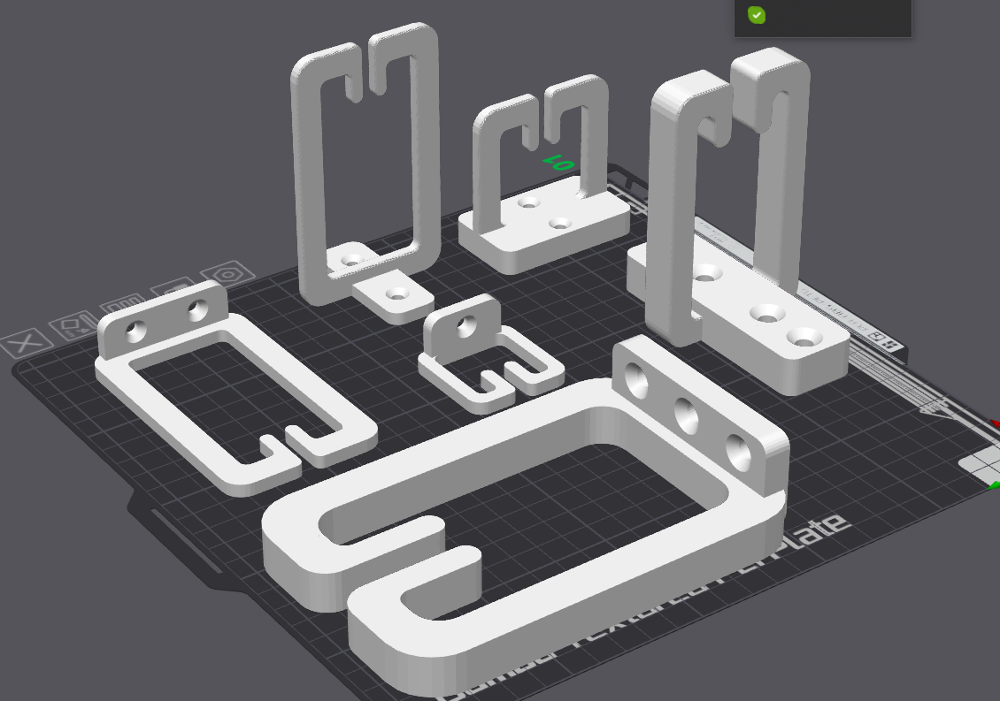

# 3D printable parametric cable holder

## Overview

This customizable cable management arm is a versatile and practical solution for organizing and securing cables. The model is created using OpenSCAD, providing users with the ability to adjust various parameters to suit their specific needs.

## Key Features

- Parametric Design: Allows full customization of dimensions such as length, height, width, thickness, and curvature.
- Cable Entry Hole: Adjustable hole size to accommodate different cable diameters, featuring inner retaining ears to secure cables in place.
- Holder Base: Configurable base plate dimensions with options for screw holes and countersinks, ensuring a secure mounting on diverse surfaces.
- High Resolution: Modeled with high-resolution settings to ensure smooth and precise 3D prints.
- Multiple baseplate positions and styles

## Customize

- Online at [MakerWorld](https://makerworld.com/en/models/535941) - just click on "customize", fill out the web form and download your STL
- On your computer with [OpenSCAD](https://openscad.org/) - edit the source to change parameters then export your STL
- Also available at [Printables](https://www.printables.com/model/939950-customizable-cable-holder)

## Printing instructions

- Select any material (PLA is good for indoors use if you make it beefy enough)
- Print flat with no support
- Prefer concentric surface patterns
- Use thick walls for added strength

## Contribute

- Pull requests are welcome on [GitHub](https://github.com/mcree/Cable-management)
- Comment, like, subscribe, publish your makes

## Changelog

v1.0 (2024-07-11) 
   - initial release

v1.1 (2024-07-13)
   - fix final output rotation
   - add support for different base styles
   - add automatic failsafe for base_radius
   - add 1mm rounded edges to the holder arm

v1.2 (2024-07-13)
   - published on github
   - updated README

## License

CC BY-NC-SA (c) by Erno Rigo <erno@rigo.info>

Free for private use. For commercial usage please contact the author.
